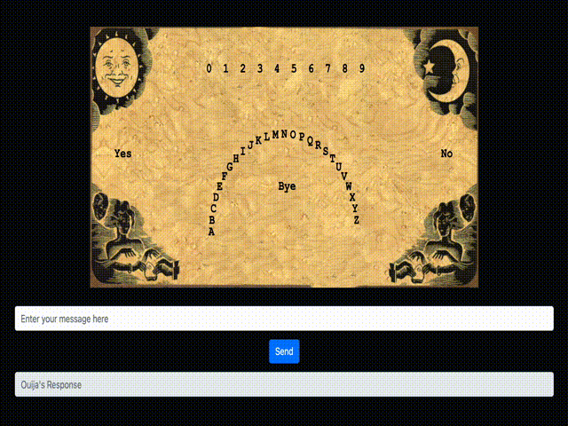

# Ouija Board

The Ouija Board project is a web-based application designed to simulate a Ouija board experience. Users can input a message, and the application will animate a response on the virtual Ouija board. This project combines modern web technologies with a touch of the supernatural to create an engaging user experience.

Version 2


Version 1


## Features

- **Interactive Ouija Board**: A virtual Ouija board that responds to user input.
- **Real-time Response Animation**: See the board spell out messages in real-time.
- **Bootstrap UI**: A clean and responsive user interface powered by Bootstrap.

## Getting Started

These instructions will get you a copy of the project up and running on your local machine for development and testing purposes.

### Prerequisites

Before you begin, ensure you have the following installed:
- Python 3.6 or later
- Flask
- A modern web browser

### Installation

1. Clone the repository:
```bash
git clone https://github.com/meirm/ouijaboard.git
```

2. Navigate to the project directory:
```bash
cd ouijaboard
```

3. Install the required Python packages:
```bash
pip install -r requirements.txt
```

4. Start the Flask application:
```bash
python app.py 
# or
python app2.py
```

5. Open your web browser and navigate to `http://127.0.0.1:5000/` to see the application in action.

## Usage

- **Sending a Message**: Enter your message in the input field and click "Send" to see the Ouija board respond.
- **Viewing Responses**: The Ouija board will animate a response, which will also be displayed in the response field.

## Contributing

Contributions are welcome, and any contributions you make are **greatly appreciated**.

1. Fork the Project
2. Create your Feature Branch (`git checkout -b feature/AmazingFeature`)
3. Commit your Changes (`git commit -m 'Add some AmazingFeature'`)
4. Push to the Branch (`git push origin feature/AmazingFeature`)
5. Open a Pull Request

## License

Distributed under the MIT License. See `LICENSE` for more information.
